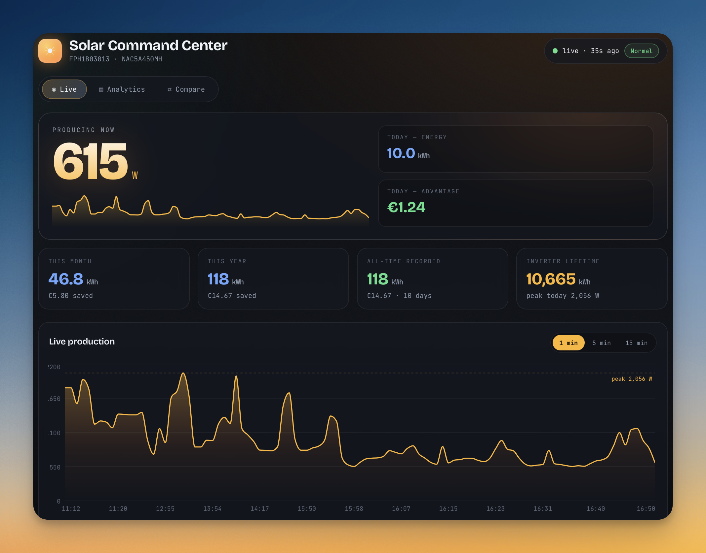

# ☀️ solar_panels_logger

Local, cloud-independent logger + web dashboard for a **Growatt** inverter,
fed by a **ShineLanBox** datalogger.



```
Logger (<LOGGER_IP>) ──▶ grott proxy (this host :5279) ──▶ server.growatt.com
                              │  (decodes Growatt protocol)
                              ▼
                         data/solar.db (SQLite)
                              │
                              ▼
                      Flask dashboard  http://127.0.0.1:8088
```

> Replace `<LOGGER_IP>` with your datalogger's LAN IP and `<THIS_HOST_IP>` with
> the machine running this project. Nothing personal is hard-coded — hosts are
> passed as flags/env vars (see below).

The grott proxy sits in the middle: it decodes the data the logger already
sends and stores it locally, **while still forwarding everything to Growatt's
cloud** so the ShinePhone app keeps working.

## What you get
- **Today**: live power (W), energy (kWh), money advantage (€), peak power.
- **Roll-ups**: this month / this year / all-time recorded kWh + €.
- **History chart**: last 60 days of kWh and € advantage.
- Auto-refreshing dashboard (every 60s by default).

## Setup (once)
grott is a third-party project and is **not vendored** here, so a fresh clone
needs one bootstrap step before the first run:
```bash
git clone git@github.com:BeppeMarnell/Grott-Dashboard.git
cd Grott-Dashboard
./scripts/setup-grott.sh          # clones grott at a pinned commit + applies the patch
cp .env.example .env              # then edit for your tariff, timezone, IPs
```
`setup-grott.sh` reads `GROTT_REPO`/`GROTT_COMMIT` (see `.env.example`) and
applies `patches/grottproxy-solar-local-ack.patch`. All other settings are env
vars — copy `.env.example` and adjust; nothing personal is hard-coded. Then run
it with Docker or natively (below), and point your logger at this host (further
down). If you skip `setup-grott.sh`, the Docker build fails because `grott/`
isn't present.

## Run it (Docker — recommended)
```bash
docker compose up -d --build     # starts grott (:5279) + dashboard (:8088)
docker compose logs -f           # watch
docker compose down              # stop
```
grott and the dashboard are **separate images** (`solar-grott`, `solar-web`).
Rebuild the UI without disturbing data capture:
```bash
docker compose up -d --build web   # only the dashboard; grott keeps running
```
After restarting grott, the logger re-onboards (reconnect → first data record →
local ACK → streaming) within a few minutes.
Open <http://localhost:8088>. Data appears after the logger's next upload (~5 min).
Both services share the `./data` volume (the SQLite db). Tariff/refresh are env
vars in `docker-compose.yml` (`SOLAR_PRICE`, `SOLAR_REFRESH`).

### Run it (native, without Docker)
```bash
./run-grott.sh     # collector/proxy on :5279
./run-web.sh       # dashboard on http://127.0.0.1:8088
```

## Point the logger at this host
Give the host running this project a **static/reserved LAN IP** (DHCP reservation
on your router) so the logger's target never changes. If it does change, the
logger keeps dialing the old address and data silently stops.

Use the helper tool (saves a backup automatically before changing). Set
`LOGGER_HOST` to your datalogger's IP and pass this host's IP to `switch`:
```bash
export LOGGER_HOST=<LOGGER_IP>              # e.g. 192.168.1.226 (admin/admin UI)
python3 scripts/logger_config.py show       # print current logger settings
python3 scripts/logger_config.py backup     # save a backup only
python3 scripts/logger_config.py switch --server-ip <THIS_HOST_IP>
python3 scripts/logger_config.py restore backups/logger-config-<ts>.json
```
`switch` sets the logger to reach this host by IP (domain resolution off, port
5279) and writes a timestamped backup to `backups/`. `restore` puts it back.
Credentials default to `admin/admin`; override with `LOGGER_USER`/`LOGGER_PASS`.
Equivalent manual path: admin panel `http://<LOGGER_IP>` →
**Network Setting** → ResolvDomain **OFF**, Server IP `<THIS_HOST_IP>`, Save.

## Configuration
Edit `config.ini`:
- `price_eur_per_kwh` — your electricity tariff, used for the € advantage.
- `refresh_seconds`, dashboard `host`/`port`.

The SQLite path can be left at its default (`data/solar.db`) or overridden with
the `SOLAR_DB` env var; `config.ini` and `grott.ini` fall back to it. All
deployment settings are documented in `.env.example`.

## Files
| Path | Purpose |
|------|---------|
| `grott/` | upstream grott (fetched by `setup-grott.sh`, not committed) |
| `patches/grottproxy-solar-local-ack.patch` | the local-ACK / ping-echo patch applied to grott |
| `scripts/setup-grott.sh` | clone pinned grott + apply the patch |
| `.env.example` | all deployment settings (copy to `.env`) |
| `extension/grott_sqlite.py` | grott extension → writes readings to SQLite |
| `grott.ini` | grott proxy config (listen :5279, forward to cloud, enable extension) |
| `web/app.py` + `web/templates/index.html` | Flask dashboard + UI |
| `config.ini` | tariff / paths / web settings (native run) |
| `Dockerfile.grott` / `Dockerfile.web` | separate images (UI rebuilds don't restart grott) |
| `docker-compose.yml`, `grott.docker.ini` | container setup |
| `web/frontend/` | React dashboard (Vite + Recharts + Framer Motion) |
| `scripts/logger_config.py` | back up / switch / restore the logger's network settings |
| `backups/` | timestamped logger-config backups (auto-written by `switch`) |
| `data/solar.db` | the recorded data |
| `run-grott.sh`, `run-web.sh` | native start scripts |

## Reset recorded data
```bash
source .venv/bin/activate
python - <<'PY'
import sqlite3; c=sqlite3.connect("data/solar.db")
c.execute("DELETE FROM samples"); c.execute("DELETE FROM daily"); c.commit()
PY
```
